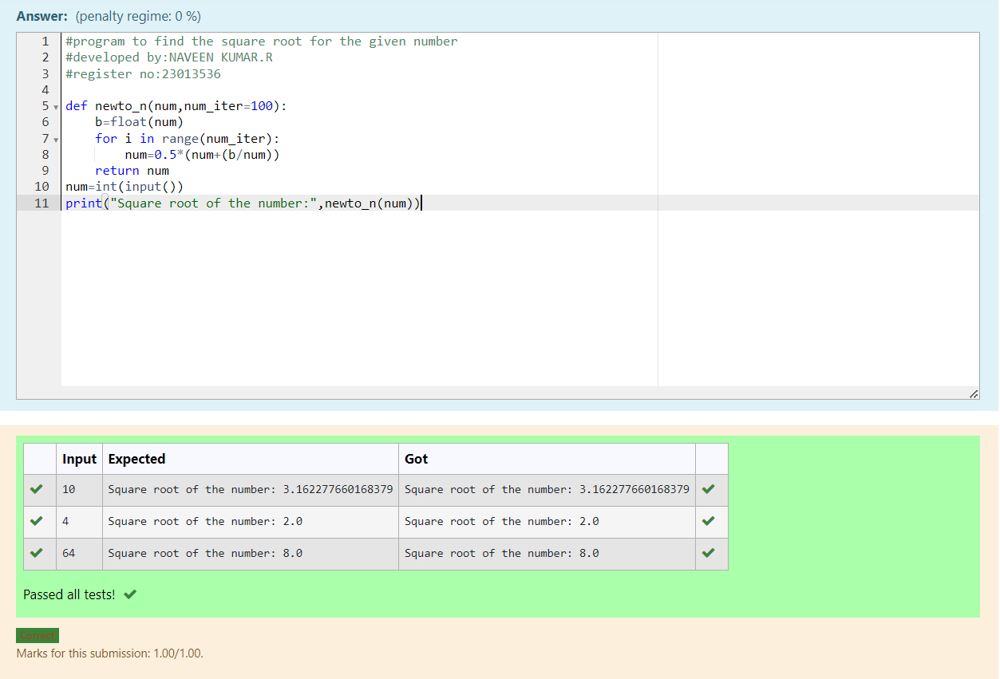

# Find the square root of a number

## AIM:
To write a program to find the square root of a number.

## Equipments Required:
1. Hardware – PCs
2. Anaconda – Python 3.7 Installation / Moodle-Code Runner

## Algorithm
1. Define a function.
2. Assign number_iters = 100 in the function to perform 100 iteratios.
3. Set i = 0.
4. Calculate  number = 0.5 * (number + a / number) for 100 iterations.
5. Return number

## Program:
```
/*
#program to find the square root for the given number
#developed by:NAVEEN KUMAR.R
#register no:23013536

def newto_n(num,num_iter=100):
    b=float(num)
    for i in range(num_iter):
        num=0.5*(num+(b/num))
    return num
num=int(input())
print("Square root of the number:",newto_n(num))
*/
```

## Output:



## Result:
Thus the program to find the square root for the given number(newton's method) using function is written and verified using python programming.
